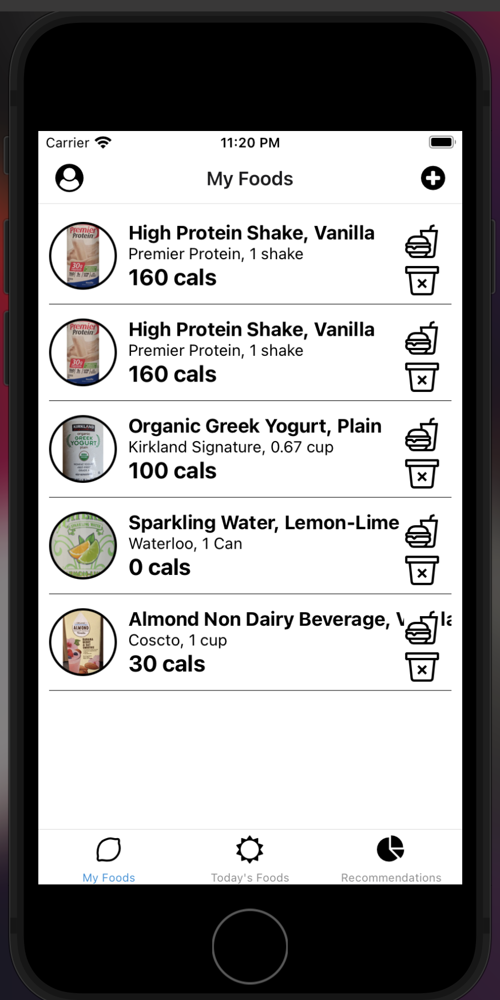
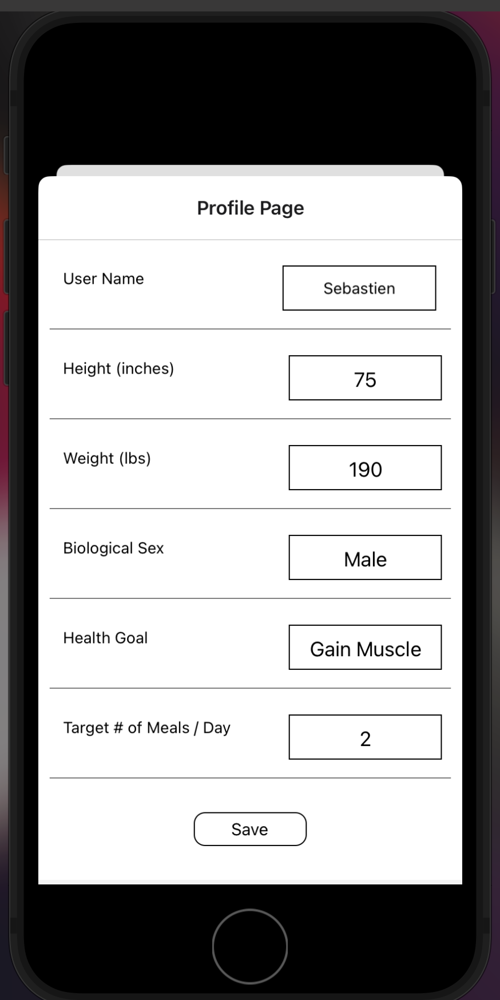
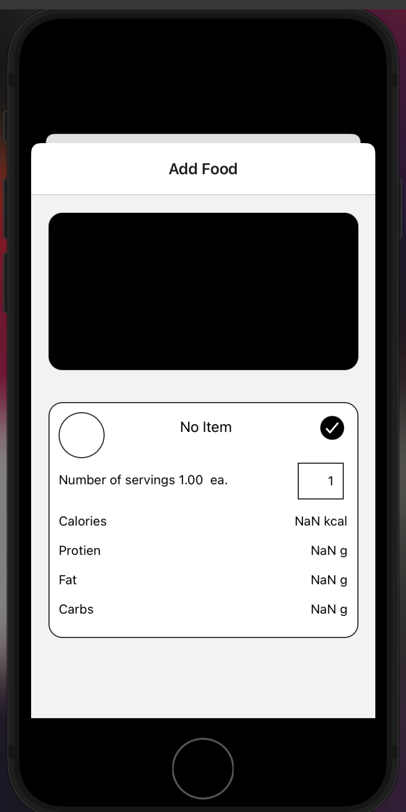
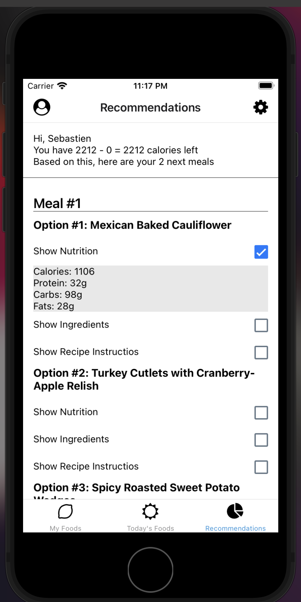
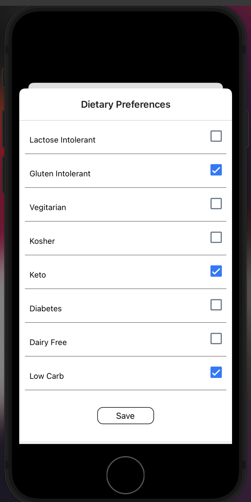

# Health-Advisor-App

Mobile Application for our CS 125 Project.

Here are some screenshots of our app!

Local Dev Steps:

1. Clone repo

2. cd Health-Advisor-App

3. Create config.json file and add secrets

4. npm install

5. npm run ios or alternatively npm start ios
